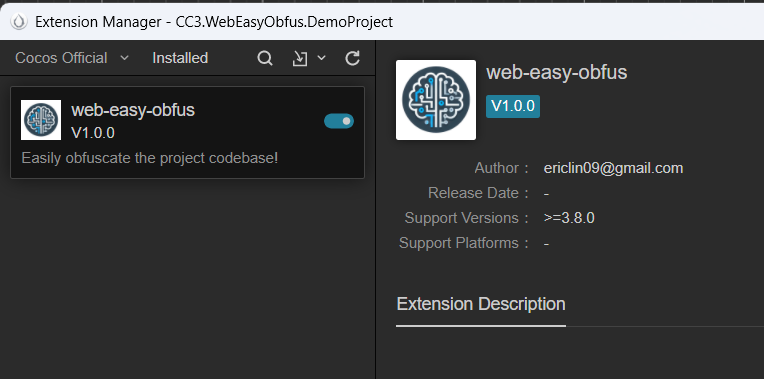

# CC3.WebEasyObfus

  

*EN | [中文](/README-CN.md)

<p align="center"></p>

雖然 CC 在建置時已經做了些混淆，但為了不讓有心人一鍵帶走項目，進一步的保護就成了鋼需。與此同時，開發團隊的 "老闆" 會預期這是簡單勾勾、選選就完成事...，這就是 WebEasyObfus 要做的事。

> *「走過路過，別錯過，點顆星星，支持我！」*

> *（注：本插件主要對開源項目 [javascript-obfuscator](https://github.com/javascript-obfuscator/javascript-obfuscator) 進行包裝。)*


## 安装方法

1. 下载项目成 ZIP 文件。

2. 解压后将内容复制到 `${your_project_path}/extensions/web-easy-obfus`。

3. 打开终端

     * 输入 `cd ${your_project_path}/extensions/web-zip-bundle`

         * 安装扩展依赖包 `npm install`

         * 构建扩展 `npm run build`

4. 到 Editor 菜单 Extension -> Extension Manager -> Installed 启用 `web-easy-obfus`。

   <p align="center"></p>

    >(*注：安装方法也可参考官方文档 [【扩展 安装与分享】](https://docs.cocos.com/creator/3.8/manual/zh/editor/extension/install.html) 。*)


## 如何使用

1. 到 Build Setting 新增 New Build Task 并选择平台 WebMobile/WebDesktop。到 Panel 中下拉找到 web-easy-obfus 选项。

    * Enable：启用或关闭功能。

        * 启用后，會對建置項目資料夾中 `${your_project_path}/build/web-mobile/assets/main/index.js` 進行混淆。 

    * Select Obfus Level：設定混淆的不同等級，主要分五個等級，等級越高混淆會徹底，檔案也會越大且執行效能會受點引響。

        * 基础 (Minimal)，對 javascript-obfuscator 設定分別為：

            ```javascript
            {
                // Minifies the output code to reduce file size.
                "compact": true, 
                // Disables converting code into a more complex control flow structure.
                "controlFlowFlattening": false,
                // Disables adding redundant dead code blocks. 
                "deadCodeInjection": false,
                // Keeps global variable names unchanged. 
                "renameGlobals": false,
                // Avoids extracting strings into a separate array for simplicity. 
                "stringArray": false 
            }
            ```

        * 标准 (Standard)，對 javascript-obfuscator 設定分別為：

            ```javascript
            {
                // Minifies the output code to reduce file size.
                "compact": true, 
                // Enables control flow flattening for added complexity.
                "controlFlowFlattening": true, 
                // Applies control flow flattening to 75% of the code.
                "controlFlowFlatteningThreshold": 0.75, 
                // Avoids injecting unnecessary dead code.
                "deadCodeInjection": false, 
                // Moves strings into a separate array for obfuscation.
                "stringArray": true, 
                // Applies string array obfuscation to 75% of strings.
                "stringArrayThreshold": 0.75 
            }
            ```

        * 增强 (Enhanced)，對 javascript-obfuscator 設定分別為：

            ```javascript
            {
                // Minifies the output code to reduce file size.
                "compact": true, 
                // Enables control flow flattening for added complexity.
                "controlFlowFlattening": true,
                // Applies control flow flattening to 90% of the code.
                "controlFlowFlatteningThreshold": 0.9,
                // Adds dead code to make reverse engineering harder.
                "deadCodeInjection": true,
                // Inserts dead code in 40% of places.
                "deadCodeInjectionThreshold": 0.4,
                // Keeps global variable names unchanged for compatibility.
                "renameGlobals": false, 
                // Moves strings into a separate array for obfuscation.
                "stringArray": true,
                // Encodes strings in the array using Base64.
                "stringArrayEncoding": ["base64"],
                // Applies string array obfuscation to 90% of strings.
                "stringArrayThreshold": 0.9,
                // Obfuscates object keys for added security.
                "transformObjectKeys": true 
            }
            ```

        * 安全 (Secure)，對 javascript-obfuscator 設定分別為：

            ```javascript
            {
                // Minifies the output code to reduce file size.
                "compact": true, 
                // Enables control flow flattening for added complexity.
                "controlFlowFlattening": true, 
                // Applies control flow flattening to all code.
                "controlFlowFlatteningThreshold": 1,
                // Adds dead code to make reverse engineering harder. 
                "deadCodeInjection": true, 
                // Inserts dead code in 50% of places.
                "deadCodeInjectionThreshold": 0.5, 
                // Renames global variables for better obfuscation.
                "renameGlobals": true,
                // Moves strings into a separate array for obfuscation. 
                "stringArray": true, 
                // Encodes strings in the array using RC4 encryption.
                "stringArrayEncoding": ["rc4"],
                // Applies string array obfuscation to all strings. 
                "stringArrayThreshold": 1, 
                // Obfuscates object keys for added security.
                "transformObjectKeys": true 
            }
            ```

        * 极致 (Ultimate)，對 javascript-obfuscator 設定分別為：

            ```javascript
            {
                // Minifies the output code to reduce file size.
                "compact": true, 
                // Enables control flow flattening for added complexity.
                "controlFlowFlattening": true, 
                // Applies control flow flattening to all code.
                "controlFlowFlatteningThreshold": 1, 
                // Adds dead code to make reverse engineering harder.
                "deadCodeInjection": true, 
                // Inserts dead code in all possible places.
                "deadCodeInjectionThreshold": 1, 
                // Renames global variables for better obfuscation.
                "renameGlobals": true,
                // Moves strings into a separate array for obfuscation. 
                "stringArray": true, 
                // Encodes strings using both Base64 and RC4 encryption.
                "stringArrayEncoding": ["base64", "rc4"], 
                // Applies string array obfuscation to all strings.
                "stringArrayThreshold": 1, 
                // Obfuscates object keys for added security.
                "transformObjectKeys": true, 
                // Converts characters to Unicode escape sequences for obfuscation.
                "unicodeEscapeSequence": true,
                // Replaces console output calls with empty functions to hide debugging messages. 
                "disableConsoleOutput": true 
            }
            ```

## 参考文献

* [javascript-obfuscator](https://github.com/javascript-obfuscator/javascript-obfuscator)

* [Cocos Creator 官方的 UI 範例 GitHub：Cocos UI Example](https://github.com/cocos/cocos-example-ui)